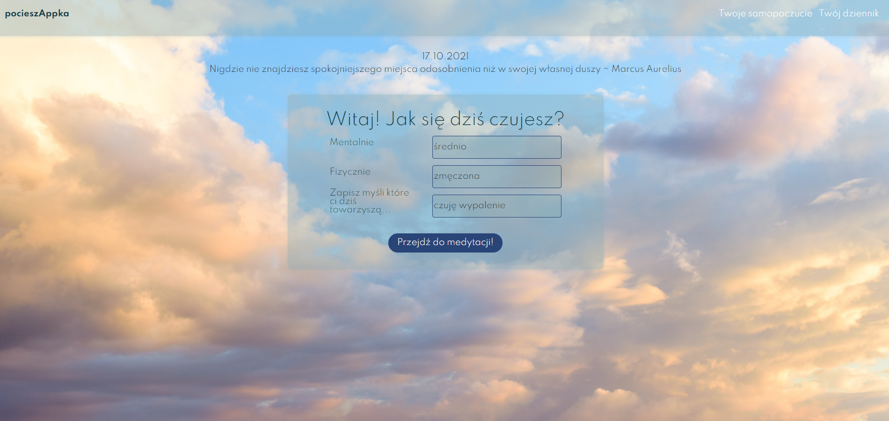
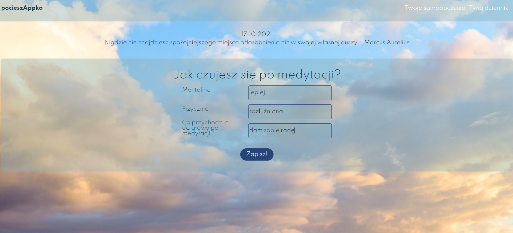
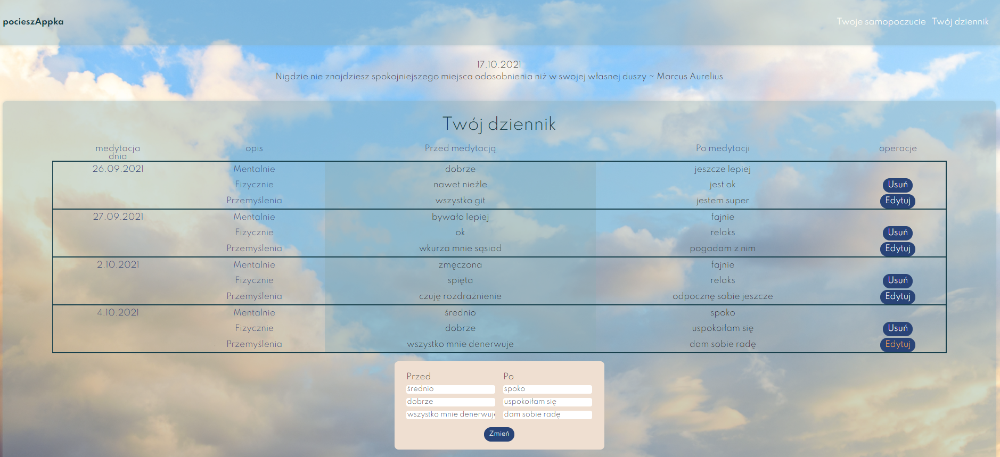

# Pocieszappka

🧘‍♀️An application created with the React library, used to monitor the effects
of meditation, practice of concentration and mindfulness. It consists of
three main components: a pre-meditation well-being form, an afterpractice form, and a summary diary where you can track the long-term
effects of your meditation🏅

💻 link to live version: https://pocieszappka.netlify.app/ 🔍

## Technologies Used

- React
- React router
- SASS

## Features

List the ready features here:

- Gathering data from first form, saving it to api and sending it via props to second form
- Updating data in api after filling the second form and saving it in api,
- Showing all gathered data in tab on "twój dziennik" site,
- Editing data in api via form on "twój dziennik" site,

To do:

- Version for mobile phones
- meditation component with timer

## Screenshots

## Project Status

Project is: _in progress_
